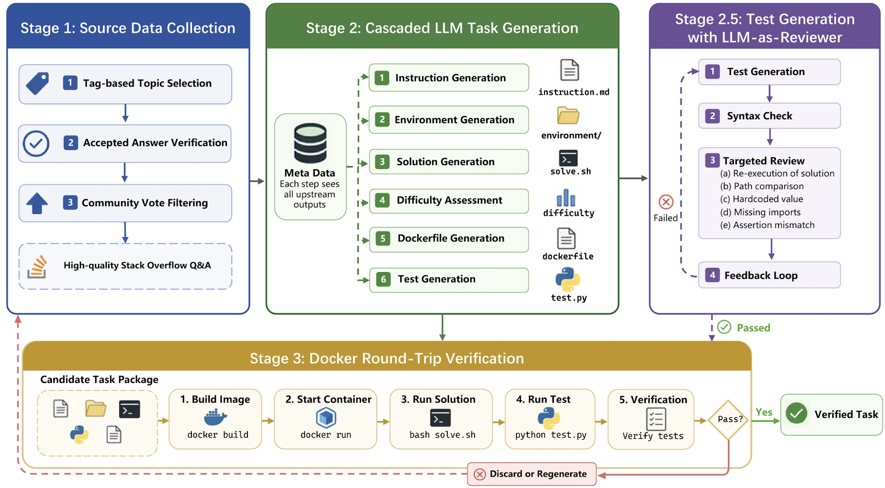

<h1 align="center"> Terminal-Lego: What Makes Interaction Trajectories Effective for Training Terminal Agents? </h1>

<p align="center">
<a href="https://huggingface.co/datasets/StephYang/Terminal-Lego-15k" > 🤗 Instances </a>
•
<a href="https://huggingface.co/datasets/SWE-Lego/Terminal-Lego-Traj-Deepseek-V3-2-15k" > 🤗 Trajectories </a>
•
<a href="https://huggingface.co/StephYang/Terminal-Lego-Qwen3-8B" > 🤗 Terminal-Lego-Qwen3-8B/32B</a>
•
<a href="https://github.com/SWE-Lego/terminal-lego" > 🧑‍💻 Code</a>
•
<a href="https://arxiv.org/pdf/2606.03461v1" > 📖 Paper</a>
</p>
<p>
<a href="https://stephen0808.github.io/terminal-lego.github.io/#" > 📖 Project</a>
</p>

## 1. 🔭 Pipeline Overview

 <p align="center">
    
  </p>

## 2. 🚀 Quick Start

### 2.1 Install dependencies

```bash
pip install -r requirements.txt
```

### 2.2 Configure

```bash
cp .env.example .env
# Edit .env with your API keys
```

Required environment variables:
- `OPENAI_API_KEY` — API key for an OpenAI-compatible LLM service
- `OPENAI_API_BASE` — API base URL (default: `https://api.openai.com/v1`)
- `SO_API_KEY` — StackOverflow API key ([get one here](https://stackapps.com/))
- `MODEL_NAME` — Model to use (default: `claude-opus-4-6`)

### 2.3 Run the full pipeline

```bash
bash run_pipeline.sh
```

This runs in a loop: scrape → generate → validate → next round.

## 3. 🔧 Running Steps Individually

### 3.1 Scrape StackOverflow

```bash
python scraper/so_scraper.py \
    --round 1 \
    --output ./data \
    --count 5000 \
    --api-key "$SO_API_KEY"
```

### 3.2 Generate Tasks

```bash
python generator/task_generator.py \
    --input ./data/so_data_r1.json \
    --output ./data/candidates_r1 \
    --workers 16 \
    --model claude-opus-4-6
```

### 3.3 Validate Tasks (requires Docker)

```bash
python validator/validate_tasks.py \
    --input ./data/candidates_r1 \
    --output ./data/validated_r1 \
    --workers 8 \
    --timeout 300
```

## 4. 📦 Output Format

Each generated task has this structure:

```
task_00001/
├── instruction.md          # Task description
├── task.toml               # Metadata (difficulty, category, tags)
├── environment/
│   ├── Dockerfile          # Container setup
│   └── task_file/          # Input files
├── solution/
│   └── solve.sh            # Reference solution
└── tests/
    ├── test.sh             # Test runner
    └── test_outputs.py     # pytest assertions
```

## 5. ⚙️ Configuration

| Variable | Default | Description |
|----------|---------|-------------|
| `CRAWL_COUNT` | 5000 | Questions to crawl per round |
| `GEN_WORKERS` | 16 | Parallel threads for generation |
| `VAL_WORKERS` | 8 | Parallel threads for validation |
| `VAL_TIMEOUT` | 300 | Docker timeout per step (seconds) |
| `MODEL_NAME` | claude-opus-4-6 | LLM model name |

## 6. 📋 Requirements

- Python 3.10+
- Docker (for validation step)
- An OpenAI-compatible API endpoint
- StackOverflow API key (optional, increases rate limits)

## 7. 📄 License

MIT
